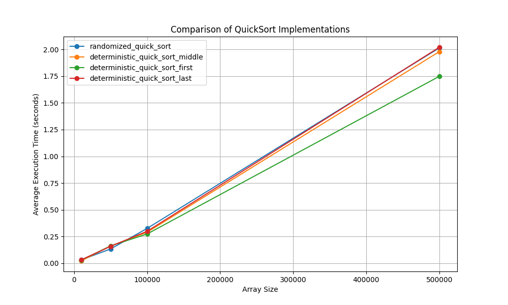

# Algo2. Home work 10
## "Algorithmic Complexity, Approximation, and Randomized Algorithms"

### Task 1. Comparison of Randomized and Deterministic `QuickSort`

Implement randomized and deterministic `QuickSort` algorithms. Conduct a comparative analysis of their efficiency by measuring the average execution time on arrays of different sizes.

#### Technical Requirements

1. For the implementation of the randomized `QuickSort` algorithm, implement the `randomized_quick_sort(arr)` function, where the pivot element is chosen randomly.

2. For the implementation of the deterministic `QuickSort` algorithm, implement the `deterministic_quick_sort(arr)` function, where the pivot element is chosen according to a fixed rule: first, last, or middle element.

3. Create a set of test arrays of different sizes: `10_000`, `50_000`, `100_000`, and `500_000` elements. Fill the arrays with random integers.

4. Measure the execution time of both algorithms on each array. For more accurate estimation, repeat the sorting of each array 5 times and calculate the average execution time.

#### Acceptance Criteria

1. The `randomized_quick_sort` and `deterministic_quick_sort` functions implement sorting algorithms and sort arrays.

2. Execution time of algorithms is measured and presented in the form of a table and graph.

3. Graphs are constructed with axis labels and legend.

4. Results are analyzed and conclusions are drawn regarding the efficiency of randomized and deterministic QuickSort.

5. Code includes usage example and meets expected results.

#### Solution

The task is implemented in [task1.py](task1.py)

Results:
```
Testing array size: 10000
randomized_quick_sort           : 0.0311 seconds
deterministic_quick_sort_middle : 0.0225 seconds
deterministic_quick_sort_first  : 0.0291 seconds
deterministic_quick_sort_last   : 0.0320 seconds

Testing array size: 50000
randomized_quick_sort           : 0.1333 seconds
deterministic_quick_sort_middle : 0.1609 seconds
deterministic_quick_sort_first  : 0.1616 seconds
deterministic_quick_sort_last   : 0.1577 seconds

Testing array size: 100000
randomized_quick_sort           : 0.3255 seconds
deterministic_quick_sort_middle : 0.2897 seconds
deterministic_quick_sort_first  : 0.2734 seconds
deterministic_quick_sort_last   : 0.2988 seconds

Testing array size: 500000
randomized_quick_sort           : 2.0146 seconds
deterministic_quick_sort_middle : 1.9797 seconds
deterministic_quick_sort_first  : 1.7485 seconds
deterministic_quick_sort_last   : 2.0207 seconds
```
<div align="center">
  
</div>


### Task 2. Creating a Class Schedule Using a Greedy Algorithm

Implement a program for creating a university class schedule using a greedy algorithm for the set cover problem. The goal is to assign teachers to subjects in a way that minimizes the number of teachers while covering all subjects.

#### Technical Requirements

Given a set of subjects: {'Mathematics', 'Physics', 'Chemistry', 'Computer Science', 'Biology'}

List of teachers:

1. Oleksandr Ivanenko, 45 years old, `o.ivanenko@example.com`, subjects: `{'Mathematics', 'Physics'}`

2. Maria Petrenko, 38 years old, `m.petrenko@example.com`, subjects: `{'Chemistry'}`

3. Serhii Kovalenko, 50 years old, `s.kovalenko@example.com`, subjects: `{'Computer Science', 'Mathematics'}`

4. Natalia Shevchenko, 29 years old, `n.shevchenko@example.com`, subjects: `{'Biology', 'Chemistry'}`

5. Dmytro Bondarenko, 35 years old, `d.bondarenko@example.com`, subjects: `{'Physics', 'Computer Science'}`

6. Olena Grytsenko, 42 years old, `o.grytsenko@example.com`, subjects: `{'Biology'}`

#### Task Description

 - Implement a `Teacher` class with the following attributes:
    - `first_name` (name)
    - `last_name` (surname)
    - `age` (age)
    - `email` (email address)
    - `can_teach_subjects` (set of subjects they can teach)

 - Implement a function `create_schedule(subjects, teachers)` that uses a greedy algorithm to assign teachers to subjects. The function should return a list of teachers and their assigned subjects.

 - During the teacher selection process at each stage, prioritize those who can teach the largest number of uncovered subjects. If there are multiple candidates, choose the youngest by age.

#### Acceptance Criteria

1. The program covers all subjects from the given set.

2. If it's impossible to cover all subjects with the available teachers, the program should output a message indicating this.

3. All subjects must be covered by teachers, and all teachers must be assigned according to their subjects.

#### Solution
The taks is implemented in [task2.py](task2.py)

Results:
```
Schedule created successfully!

Teacher Assignments:

Natalia Shevchenko, age: 29, email: n.shevchenko@example.com
  Subjects: Biology, Chemistry

Dmytro Bondarenko, age: 35, email: d.bondarenko@example.com
  Subjects: Physics, Computer Science

Oleksandr Ivanenko, age: 45, email: o.ivanenko@example.com
  Subjects: Mathematics
```
